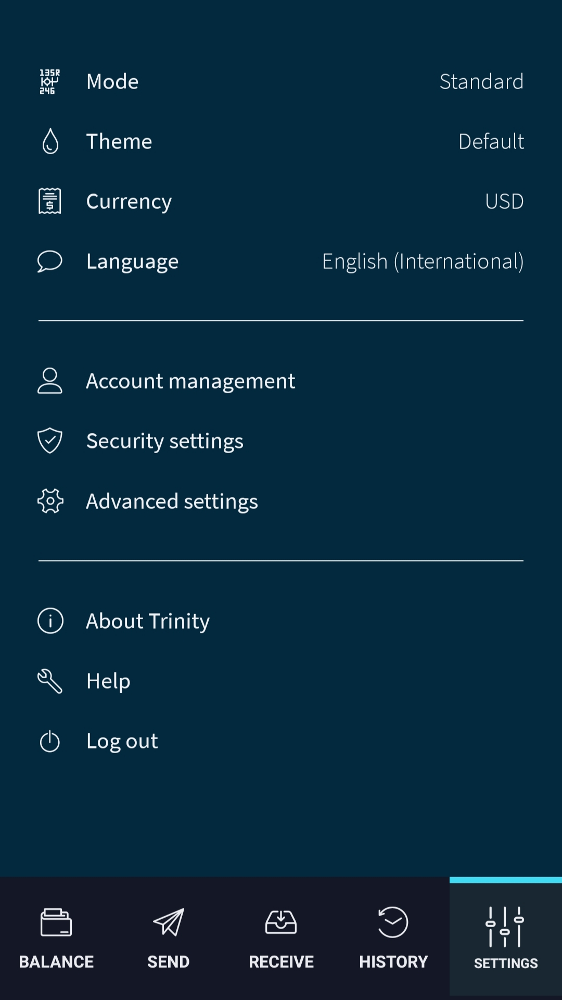

# Manage your account

**Trinity allows you to have more than one account, each of which has a unique seed.**

:::danger:
On 11 February 2020, the IOTA Foundation became aware of an attack on the Trinity wallet, during which some users’ seeds and Trinity passwords were compromised. Please check our advice for [protecting your Trinity account](../how-to-guides/protect-trinity-account.md).
:::

For each of your accounts, you can do the following:

- Access your seed (not available if you use a hardware wallet)
- View your addresses and their available balance
- Change the name of an account

Make sure that you select the correct account to manage before completing any of these tasks.

--------------------
### Desktop

To access Account management, go to **Trinity** > **Settings** > **Account management**

---
### Mobile

To access Account management, go to **Settings** > **Account management**

--------------------

## Access your seed

Each account that you create uses a different seed.

To access the seed, go to Account management, and click **View seed**.

## View your addresses

Each seed can be used to generate an almost unlimited number of addresses.

To view the addresses that you've generated, go to Account management, and click **View addresses**.

:::info:
A red line through the center of an address means that the address has been spent. Trinity stops you from withdrawing IOTA tokens from [spent addresses](root://getting-started/0.1/clients/addresses.md#spent-addresses), so you must never deposit IOTA tokens into them.
::: 

## Change your account's name

To make it easier to manage multiple accounts, you can give each of them a unique name.

To change the name of an account, go to Account management, and click **Account name**.

## Change your login password

Trinity stores your seeds for you (unless you use a [hardware wallet](../concepts/hardware-wallet.md)) and allows you to log in with a password.

--------------------
### Desktop

To change the login password, go to **Trinity** > **Settings** > **Change password**

---
### Mobile

To change the login password, go to **Settings** > **Security settings** > **Change password**
--------------------

## Next steps

[Send a transaction](../how-to-guides/send-a-transaction.md)
