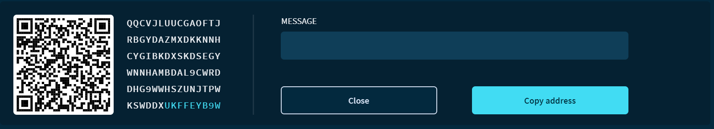

# Receive a transaction

**To receive a transaction, you need to generate a new [address](root://getting-started/0.1/clients/addresses.md) and give it to the sender. In this guide, you generate a new address in Trinity and consider in which format to give it to the sender.**

:::danger:
On 11 February 2020, the IOTA Foundation became aware of an attack on the Trinity wallet, during which some users’ seeds and Trinity passwords were compromised. Please check our advice for [protecting your Trinity account](../how-to-guides/protect-trinity-account.md).
:::

1. Click **Receive**

2. Click **Generate address** to generate a new address

3. Either copy the address and give it to the sender, [create a QR code](../how-to-guides/create-a-qr-code.md), or [create a deep link](../how-to-guides/create-deep-link.md).

    :::danger:Important
    On Android devices, any application can read the content of keyboard presses and modify it. Be careful when pasting an address into another app and make sure that the address you have pasted is the same one that you copied.
    :::

    
    
4. When you either receive or send a transaction, it appears on the home page. Click a transaction from the list to view information about it.

    

    :::info:
    The Addresses field is displayed only in [Advanced mode](../how-to-guides/change-the-general-settings.md).
    :::

:::success:
Now you know how to give others your addresses so they can send you transactions.
:::

## Next steps

[Connect to a custom node](../how-to-guides/connect-to-a-custom-node.md).