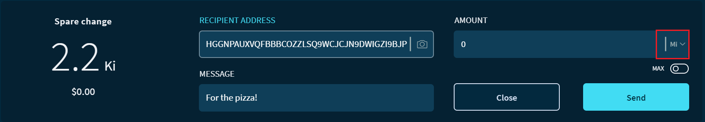
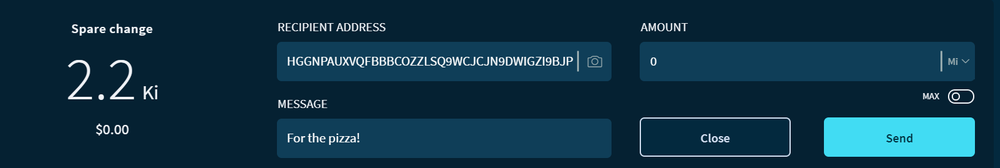

# Send a transaction

**In Trinity, you can send a transaction to a [node](root://getting-started/0.1/network/nodes.md) by entering an [address](root://getting-started/0.1/clients/addresses.md), a message, and/or an amount of [IOTA tokens](root://getting-started/0.1/clients/token.md). In this guide, you learn how to send a transaction in Trinity.**

:::danger:
On 11 February 2020, the IOTA Foundation became aware of an attack on the Trinity wallet, during which some users’ seeds and Trinity passwords were compromised. Please check our advice for [protecting your Trinity account](../how-to-guides/protect-trinity-account.md).
:::

:::info:
The Addresses field is displayed only in [Advanced mode](../how-to-guides/change-the-general-settings.md).
:::

## Step 1. Choose an IOTA network

You can send transaction to a node on any [IOTA network](root://getting-started/0.1/network/iota-networks.md).

By default, Trinity connects to a [quorum](../concepts/node-quorum.md) of Mainnet nodes, which maintain the main IOTA network where IOTA tokens have a value.

If you're testing IOTA, you may want to [connect to a Devnet node](../how-to-guides/connect-to-a-custom-node.md).

## Step 2. Send a transaction

When you're connected to a node on your chosen IOTA network, you can send it a transaction.

1. Click **Send**

2. Enter a recipient's address

    :::danger:Important
    On Android devices, applications can read and modify keyboard presses. Be careful when pasting an address into Trinity and use the checksum to make sure that the address you have pasted is the same one that you copied.
    :::

3. Enter either a message, or an amount of IOTA tokens, or both

    :::info:
    The amount to send can be entered in [units of IOTA tokens](root://getting-started/0.1/clients/token.md#units-of-iota-tokens) or in the [currency of your choice](../how-to-guides/change-the-general-settings.md). Pay close attention to the amount that you're sending.
    :::

    :::info:
    If your account is linked to a hardware wallet, you can send either IOTA tokens or a message, but not both.
    :::

    
    
4. Click **Send**

    

    :::info:
    If you minimize Trinity Mobile, the sending process pauses until you reopen it.
    :::

:::success:
Sent transactions are saved in the transaction history, where you can see information such as their status.
:::

## Next steps

[Receive a transaction](../how-to-guides/receive-a-transaction.md).

