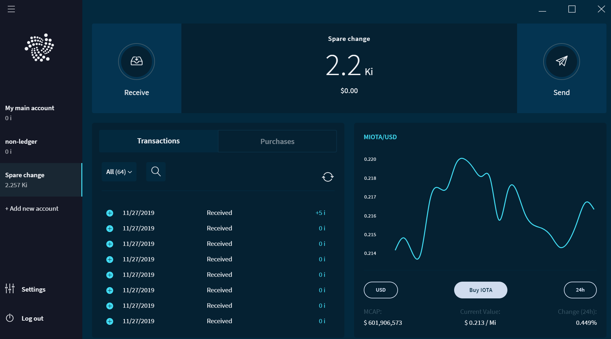

# Trinity overview

**Trinity is a mobile and desktop application with a user interface that allows you to transfer data and IOTA tokens. With Trinity you can encrypt and store one or more seeds, where each one has its own account, transaction history, and settings.**

:::danger:
On 11 February 2020, the IOTA Foundation became aware of an attack on the Trinity wallet, during which some users’ seeds and Trinity passwords were compromised. Please check our advice for [protecting your Trinity account](../how-to-guides/protect-trinity-account.md).
:::

Trinity allows you to do the following:

- Create a password-protected account to store and access your seeds
- Read your balance and transaction history
- Send and receive transactions

:::info:
[Download and install Trinity](https://trinity.iota.org/)
:::

## Security

To use Trinity, you must enter your seed. Therefore, to ensure the security of your IOTA tokens, Trinity has been audited by external parties.

If you find a vulnerability and you report it to us, you'll receive a monetary reward through our [bug bounty](https://bugcrowd.com/iota).

## Limitations

Trinity mobile does not support background processes. If you navigate to another app while an action (for example, logging in, sending transactions, and refreshing your balance) is ongoing, that action **won't** be completed.

## Blog posts

Read the following blog posts about Trinity:

- [IOTA Foundation Releases the Results of the Trinity Security Audit by SIXGEN](https://blog.iota.org/iota-foundation-releases-the-results-of-the-trinity-security-audit-by-sixgen-a8c5841bd551)
- [Trinity Public Bug Bounty](https://blog.iota.org/trinity-public-bug-bounty-df9d2512e50)
- [What’s next for Trinity?](https://blog.iota.org/the-next-steps-for-trinity-f9af3fc64736)

## Repository

Go to the Trinity source code on [Github](https://github.com/iotaledger/trinity-wallet).

## Discord channels

[Join our Discord channel](https://discord.iota.org) where you can:

- Take part in discussions with IOTA developers and the community
- Ask for help
- Share your knowledge to help others

We have the following channels for Trinity:

- **#trinity-announcements:** A read-only channel where announcements such as new releases are made

- **#trinity-dev:** A read-only channel where developers discuss topics and where any GitHub updates are displayed

- **#trinity-discussion:** An open channel where anyone is free to discuss Trinity

- **#trinity-translators:** An open channel where anyone is free to contribute to translation-related discussions